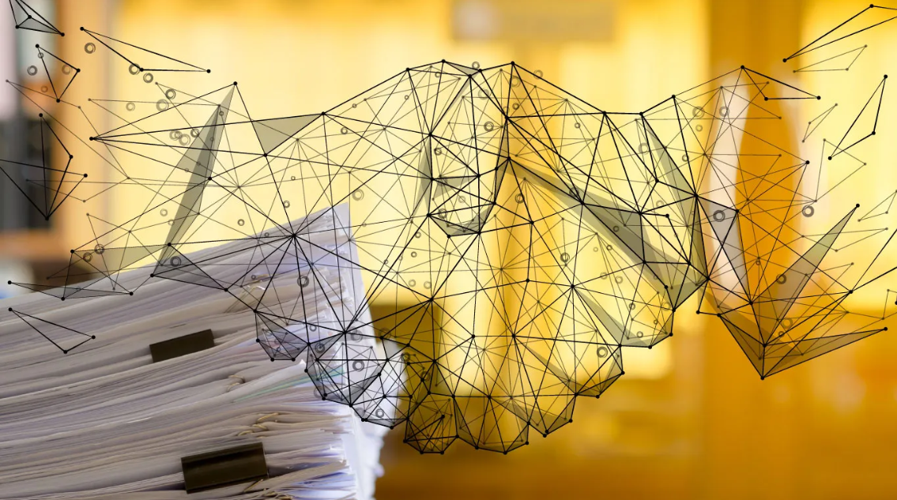

# Supply Chain Management Smart Contract

## Vision


The vision of this project is to revolutionize the traditional supply chain industry by leveraging blockchain technology to ensure transparency, traceability, and security throughout the product lifecycle. Our smart contract-based solution provides a decentralized platform where manufacturers, transporters, and retailers can collaboratively manage and monitor the movement of goods, reducing fraud, increasing efficiency, and building trust among all stakeholders.

## Flowchart

Below is a simplified flowchart illustrating the workflow of the Supply Chain smart contract:

```
+---------------------------------+
| Manufacturer                    |
|                                 |
| 1. Add Product                  |
|    - ID, Name                   |
+---------------------------------+
             |
             v
+---------------------------------+
| Supply Chain Contract           |
|                                 |
| 2. Store Product Details        |
|    - ID, Name, Manufacturer     |
|    - Initial State: Manufactured|
+---------------------------------+
             |
             v
+---------------------------------+
| Transporter                     |
|                                 |
| 3. Update Product State         |
|    - State: InTransit           |
+---------------------------------+
             |
             v
+---------------------------------+
| Retailer                        |
|                                 |
| 4. Update Product State         |
|    - State: Delivered           |
+---------------------------------+
             |
             v
+---------------------------------+
| Consumer                        |
|                                 |
| 5. Verify Product Details       |
|    - ID, Name, Manufacturer     |
|    - State: Delivered           |
+---------------------------------+
```

## Smart Contract Details

- **Contract Name**: `SupplyChain`
- **Compiler Version**: `^0.8.0`
- **License**: MIT
- **Contract Address**: 0xd8b934580fcE35a11B58C6D73aDeE468a2833fa8


## Functions

1. **addProduct**:
   - Adds a new product to the supply chain.
   - Parameters: `uint256 _id`, `string memory _name`
   - Only callable by the manufacturer.

2. **updateProductState**:
   - Updates the state of the product (InTransit, Delivered).
   - Parameters: `uint256 _id`, `State _state`
   - Callable by anyone involved in the supply chain.

3. **getProduct**:
   - Retrieves product details using the product ID.
   - Parameters: `uint256 _id`
   - Returns: Product ID, Name, Manufacturer Address, and Current State.

## Future Scope

- **Role-Based Access Control**: Implement granular access control, allowing only specific roles (e.g., transporters, retailers) to update the state of products.
- **Extended State Management**: Add additional states like `Inspected`, `Packaged`, and `Received` to accommodate more complex supply chains.
- **Ownership Transfer**: Implement features to transfer product ownership as it moves through the supply chain.
- **Integration with IoT Devices**: Automate state updates using IoT devices that can detect when products are in transit or delivered.

## Contact Information

For more details about the project or if you have any queries, feel free to reach out:

- **Name**: Lamjingba Ningombam
- **Email**:lamjingbaningombam@gmail.com
- **LinkedIn**: [www.linkedin.com/in/lamjingba-ningombam-2590a7324](https://www.linkedin.com/in/lamjingba-ningombam-2590a7324/)
- **GitHub**: https://github.com/LamjingbaNingombam